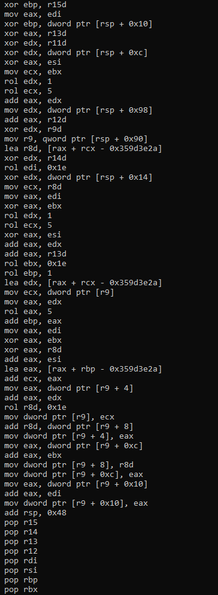

# Lura-DBI

A QEMU TCG plugin framework and header-only C++ pipeline for capturing full-system execution traces from a running QEMU 
guest and reconstructing them into analyzable, graph-based data.

## Example Usages

### Finding SHA-1 Hashing Algorithm Routine in Windows Vista 
Captured and analyzed over **4.4 million executed instructions** from a Windows Vista boot to reconstruct the execution trace and identify Vista's SHA-1 hashing routine.



### Execution Metrics by Target Environment

#### x86_64 Windows Vista (Boot-to-Usage)
* **Total Instructions Traced:** 4,416,040
* **Total Blocks Captured:** 1,666,684
* **Total Edges Resolved:** 842,434
* **Edge Resolution:** 100% Dynamic Truth Edges

#### x86_64 Alpine Linux (Boot-Setup-Usage)
* **Total Instructions Traced:** 1,268,502
* **Total Blocks Captured:** 471,241
* **Total Edges Resolved:** 247,460
* **Edge Resolution:** 100% Dynamic Truth Edges

#### AArch64 Alpine Linux (Boot-Setup-Usage)
* **Total Instructions Traced:** 1,394,419
* **Total Blocks Captured:** 480,654
* **Total Edges Resolved:** 250,424
* **Edge Resolution:** 100% Dynamic Truth Edges

## Why Dynamic Analysis (DBI) Over Static Analysis?

While static analysis tools like IDA Pro or Ghidra are very good for high-level analysis, 
they struggle a lot when dealing with complexity like: malware obfuscation and low-level operating system behaviors. 

Lura-DBI uses **Dynamic Binary Instrumentation (DBI)** via QEMU to overcome these limitations:

* **Code Obfuscation and Packing:** Static analyzers often fail when encountering packed, encrypted, or self-modifying code because the actual instructions do not exist on disk in a readable format. Lura-DBI captures instructions at the TCG (Translation Block) level after they have been decrypted and are actively executing in memory.
* **Precise Control Flow Graph (CFG) Resolution:** Static tools frequently guess or fail to resolve indirect jumps, switch tables, and virtualized function calls (e.g. C++ VTables or Dynamic API resolving). Because Lura-DBI records the exact path the CPU took, your reconstructed CFG contains **100% truth edges** rather than heuristic guesses.
* **Full-System & Kernel-Level Visibility:** Analyzing a monolithic operating system kernel or low-level drivers statically is incredibly difficult. Lura-DBI captures the entire environment, handling hardware interrupts, and logging MMIO interactions as they happen.
* **Reality vs. Dead Code:** Static analysis requires you to sift through gigabytes of dead code or error-handling paths that may never actually run. DBI allows you to focus purely on the exact execution trace of interest (such as a specific cryptographic stub like SHA-1 executing inside a Windows Vista boot cycle), cutting out the noise entirely.

## Overview

Lura-DBI instruments a QEMU guest at the translation-block level: every translated block, its instructions, control-flow edges, 
interrupts, VCPU pause/resume states, and MMIO accesses are captured per-VCPU and streamed to disk in 
[CPU-Tracer](https://github.com/Pidova/CPU-Tracer) block format. 
A separate offline pipeline then loads that trace back, reconstructs its control flow, and can render it as a linearized listing 
or a Boost Graph Library CFG using [CFG-Tools](https://github.com/Pidova/CFG-Tools).

The project is split into three pieces:
* **QEMU plugin** (**QEMU/**) - a shared library loaded into QEMU via **-plugin**, responsible for capturing the raw trace
* **Example** (**Example/**) - a standalone program that loads a trace, reconstructs its CFG, and prints a linearized listing
* **shared/** - Copies of CPU-Tracer and CFG-Tools, the two header-only libraries the plugin and Example build on

## Prerequisites

* [CMake](https://cmake.org/) >= 3.31
* A C++23 compiler (MSVC, Clang, or GCC)
* [Conan](https://conan.io/) 2.x - dependencies resolve automatically at configure time through [conan_provider.cmake](https://github.com/conan-io/cmake-conan), no manual **conan install** step is required
* A QEMU source/build tree with plugin support enabled (**--enable-plugins**), for **qemu/qemu-plugin.h**, System variable needs to be named **QEMU_INCLUDE_DIR**


Dependencies below are declared in [conandata.yml](conandata.yml) and resolved by Conan automatically:

* [Boost](https://www.boost.org/) 1.88.0 - **boost::graph**, **boost::asio**, **boost::icl**, **boost::container**, **boost::smart_ptr**, **boost::sort**
* [capstone](https://github.com/capstone-engine/capstone) 5.0.6 - disassembly / interpretation-mode detection
* [glib](https://gitlab.gnome.org/GNOME/glib) 2.85.3 - required by the QEMU plugin ABI (**GByteArray**, **GArray**)
* [rapidjson](https://github.com/Tencent/rapidjson) 1.1.0
* [lz4](https://github.com/lz4/lz4) 1.10.0 - edge compression, via CPU-Tracer

## Building

Set **QEMU_INCLUDE_DIR** to the **include** directory of a QEMU tree built with plugin support:
### Windows
```
set QEMU_INCLUDE_DIR=C:\qemu\include
```

## Linux/macOS
```
export QEMU_INCLUDE_DIR=/path/to/qemu/include 
```

Configure and build; Conan dependencies are resolved automatically via **conan_provider.cmake**:
```
cmake -B build
cmake --build build --config Release
```

This produces two targets:
* **QEMU** - the plugin shared library (**QEMU.dll** / **libQEMU.so**)
* **Example** - a standalone executable that loads and analyzes the trace files the plugin writes out

## Running

Load the plugin into QEMU with **-plugin**:
```
qemu-system-x86_64.exe -plugin C:\path\to\QEMU.dll -drive file=disk.img,format=raw
```
Full examples (MS-DOS, Windows Vista, Windows 10 boots) and instructions for stopping a trace safely are in [docs/QEMU.md](docs/QEMU.md).
Trace files are written to **config::SAVE_DIRECTORY** (default **C:\qemudumps\blocks\**): one main save file plus one edge file per VCPU to eliminate mutex overhead.

## Importing

Pipeline (as in **Example/main.cpp** does) just requires libraries:
```cpp
#include "shared/cpu_tracer/common.hpp"
#include "shared/cfg_tools/common.hpp"
```

## Libraries

Two standalone, header-only libraries:
* [CPU-Tracer](https://github.com/Pidova/CPU-Tracer) - on-disk block/edge format, streaming load & analysis, BGL graph construction
* [CFG-Tools](https://github.com/Pidova/CFG-Tools) - CFG linearization and modularization, used by **Example** to print it
* [BoostPP flat vector](https://github.com/Pidova/BoostPP/blob/main/vector.hpp) - used internally by CPU-Tracer for fixed-capacity instruction/edge buffers

## Documentation and Examples

All documentation and examples for each can be found:
* [QEMU Plugin](docs/QEMU.md) - Plugin architecture, Architecture support, callback registration, block/edge/interrupt/MMIO capture, Architecture Specific edge signaling, configuration and debug macros
* [Example](docs/Example.md) - Load a trace, reconstruct its CFG, and print a linearized listing

## Current Guest Architecture Support
Current supporting guest architecture: **x86_64**, **AArch64/ARM**.
Adding support for another architecture can be found here [docs/QEMU.md](docs/QEMU.md).