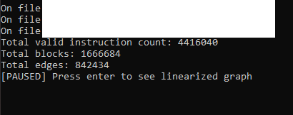
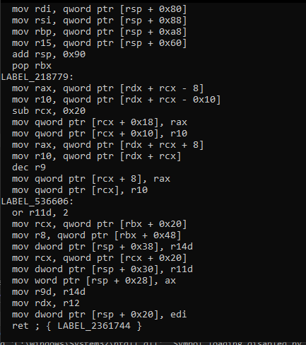

# Example Program
A small program that loads Lura-DBI trace files from disk, reconstructs their control flow with CPU-Tracer, and prints a linearized, labeled disassembly listing using CFG-Tools.
**Sample data needs to correlate with config architecture details of that can be found in: **[QEMU.md](QEMU.md)

## Example Output

### Window-Vista: Instruction Statistics 
Boot-to-Usage run of Windows-Vista Translation Block count and edges with instruction count.



### Window-Vista: Truncated Linearized Run
Truncated Linearized run with final text being over **24.3GB**.



## What does Example do?
Every file under **config::SAVE_DIRECTORY** is streamed into memory and analyzed with 
CPU-Tracer (see [Loading & Analysis](https://github.com/Pidova/CPU-Tracer/blob/main/docs/loading_and_analysis.md)), producing a sorted, indexed block set and a resolved successor/predecessor edge map.
That data is turned into a **boost::adjacency_list** CFG with CPU-Tracer's [Graph Construction](https://github.com/Pidova/CPU-Tracer/blob/main/docs/graph.md), 
which CFG-Tools then walks to produce an ordered, labeled text listing (see [Linearization](https://github.com/Pidova/CFG-Tools/blob/main/docs/linearization.md)).

## Idea

```
trace files -> loader::load (per file)  -> save_data
            -> analyze::analyze          -> analyzed_data  (sorted/indexed blocks)
            -> analyze::analyze          -> edge_data      (successor/predecessor map)
            -> tools::fix_blocks         -> repaired block boundaries
            -> graph::generate_graph     -> boost::adjacency_list CFG
            -> cfg_tools::linearize      -> ordered, labeled text
```

## Algorithm

### Loading & analysis

Every regular file in **config::SAVE_DIRECTORY** is opened and streamed into a shared **save_data** container with **cpu_tracer::blocks::loader::load**. 
Once every file has been loaded, **analyze::analyze** is run twice: 
once to sort and index the combined block set into **analyzed_data**, and once to fold raw edges, instruction-to-instruction transitions, and interrupts into **edge_data**. **tools::fix_blocks** 
then repairs any block whose boundary a reconstructed edge lands in the middle of.

### Node string compilation

Before linearizing, Example pre-formats every block into a display string. 
Each instruction is disassembled with Capstone using the block's own **interpretation_id** (looked up per-mode in **cap_map**), and self-modified instructions (**finsts::fself_modified**) 
are prefixed with **[V]**. Only the last instruction in a block has its outgoing edges resolved: a single fallthrough-adjacent destination is inlined directly into the operand string, 
while multiple or non-adjacent destinations are appended as a **; { label label ... }** reference list. Any destination block referenced this way gets a generated label (**edge_data::gen_label**) 
prefixed onto its own string, so the final listing only shows labels where something actually jumps to them.

### Graph construction & linearization

**cpu_tracer::blocks::graph::generate_graph** turns **analyzed_data** and **edge_data** into a **boost::adjacency_list**. 
A **cfg_tools::cb_node_string** callback looks each vertex's block up in the pre-formatted node map, and **cfg_tools::linearize** walks the graph in topological (or DFS postorder, if cyclic) order,
streaming the ordered listing to **std::cout**.


## Example

A trimmed version of **Example/main.cpp**; see the full file for the complete program including Capstone handle setup.

```cpp
#include "../config.hpp"
#include "../shared/cfg_tools/common.hpp"
#include "../shared/cpu_tracer/common.hpp"
#include <boost/graph/adjacency_list.hpp>
#include <filesystem>
#include <iostream>

using save_data = cpu_tracer::blocks::loader::save_data<config::MAX_LEN>;
using analyzed_data = cpu_tracer::blocks::loader::analyze::analyzed_data<config::MAX_LEN>;
using edge_data = cpu_tracer::blocks::loader::analyze::edge_data;

save_data sdata;
analyzed_data adata;
edge_data edata;

/* Load every trace file in the save directory */
for (const auto &entry : std::filesystem::directory_iterator(config::SAVE_DIRECTORY)) {
      if (!entry.is_regular_file()) {
            continue;
      }
      std::ifstream file(entry.path(), std::ios::binary);
      cpu_tracer::blocks::loader::load(sdata, file);
}

/* Analyze data */
cpu_tracer::blocks::loader::analyze::analyze(adata, sdata);
cpu_tracer::blocks::loader::analyze::analyze(edata, sdata, adata);
cpu_tracer::blocks::loader::tools::fix_blocks(edata, adata, sdata);

std::printf("Total blocks: %zu\n", sdata.block_map.size());
std::printf("Total edges: %zu\n", edata.successors.size());

/* Build the CFG and linearize it */
const auto g = cpu_tracer::blocks::graph::generate_graph(adata, edata);

using graph_t = std::remove_cvref_t<decltype(g)>;
cfg_tools::cb_node_string<graph_t> func = [&](const graph_t &graph, const cfg_tools::basic_block<graph_t> &bb) {
      /* [[ RETURN THE PRE-FORMATTED DISASSEMBLY STRING FOR THIS BLOCK ]] */
      return std::string("");
};

cfg_tools::linearize(g, func, std::cout);
```

Output (matches the screenshots above; exact counts depend on the trace):

```
Total valid instruction count: N
Total blocks: N
Total edges: N
[PAUSED] Press enter to see linearized graph
```
